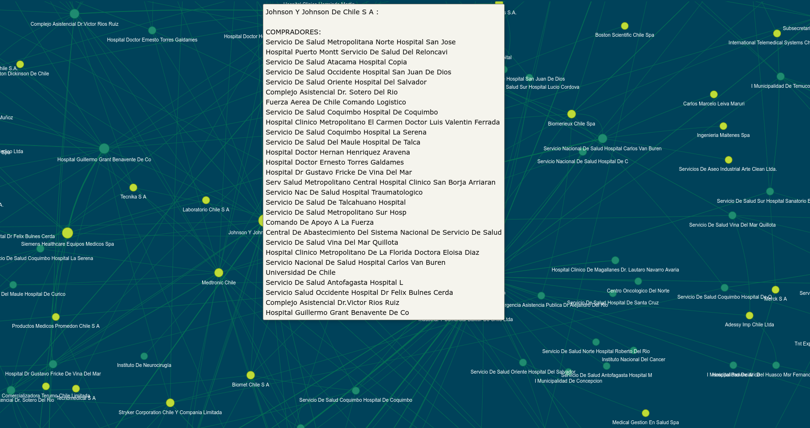
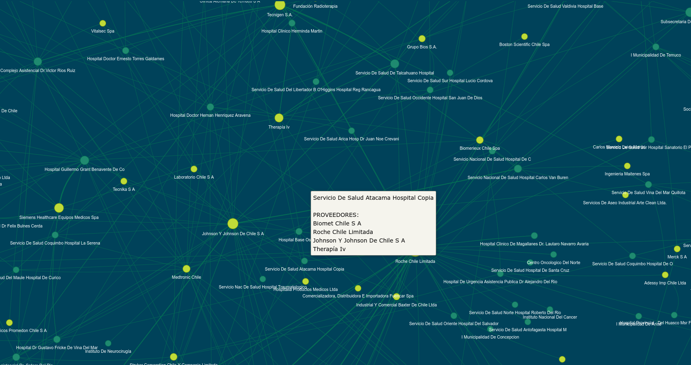

# Proyecto de visualización de redes utilizando Python

Este proyecto tiene por objectivo generar una visualización de la red de ordenes de compra del Mercado Público, en el se demuestran mis habilidades con Python, incluyendo el manejo y análisis de grandes conjuntos de datos y la construcción de visualizaciones interactivas y atractivas.

En este proyecto, utilicé principalmente pandas y pyvis para construir una visualización de redes a partir de datos de públicos. Se utilizan 4.729.767 de datos, que se reducen a 970 nodos y 1.082 conexiones.

